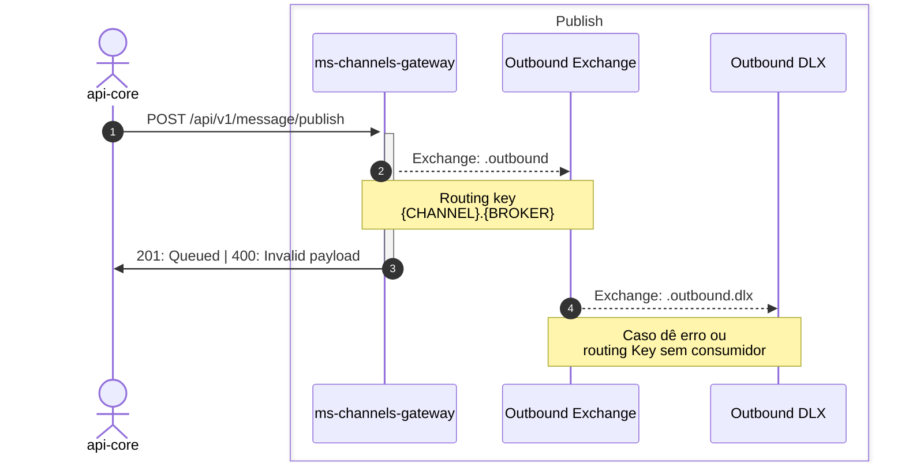
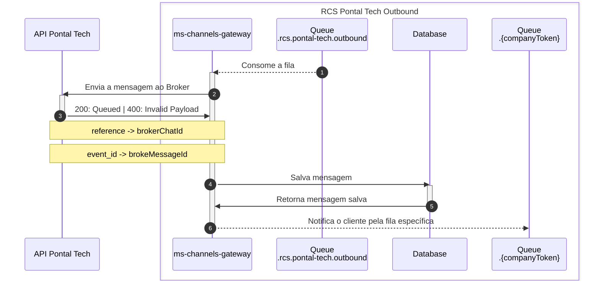

# Channels gateway

Projeto que será responsável por rotear as mensagens ao seus respectivos pares de Channel -> Broker

## Casos de uso

> Todas as exchanges e filas tem o prefixo ms-channels-gateway, suprimido dos diagramas que começam apenas com . (ponto), ex: .outbound se refere a exchange ms-channels-gateway.outbound

### Outbound
> **Ativo** ::  _plataforma -> cliente_

### Publish
> _POST_ /api/v1/message/publish

Fluxo responsável por receber uma mensagem, validar o payload e enfileirar para processamento de acordo com as configurações do channelConfigId

- Validação de payload de acordo com o type + messageType
- Valida se o channelConfigId é válido, ou seja, existe e o status é ATIVO

#### Estrutura base
```json
{
    "channelConfigId": "",
    "referenceChatId": "",
    "recipients": [
        "11988881234"
    ],
    "payload": {
        "type": "rcs",
        "content": {/* text, image, document, carousel, rich card */}
    }
}
```
#### text
```json
{            
  "messageType": "text",
  "text": "Olá, somos da Digitalk! Vamos testar?"
}
```
> text deve ter no máximo 2000 caracteres

#### image

```json
{
    "messageType": "image",
    "url": "https://example.com/image.png"          
}
```

#### document
> IMPORTANTE!:  Atualmente a Pontal Tech só envia documentos do tipo PDF. Qualquer outro tipo é retornado erro 400

```json
{
    "messageType": "document",
    "url": "https://example.com/document.pdf"          
}
```

#### carousel
```json
{
  "messageType": "carousel",
  "items": [
      {
          "title": "Item 1",
          "description": "Já chegam sabendo onde fazer as necessidades <3",
          "fileUrl": "https://example.com/image.png"
      },
  ]  
}
```
> item.tile deve ter no máximo 160 caracteres<br>
> item.description deve ter no máximo 2000 caracteres

#### rich-card
```json
{
  "messageType": "rich-card",
  "title": "Que tal um rich card com gatinhos?",
  "description": "E uma descrição massa?!",
  "fileUrl": "https://example.com/image.png" 
}
```
> tile deve ter no máximo 160 caracteres<br>
> description deve ter no máximo 2000 caracteres

### Diagrama de fluxo da publicação de mensagem



### Diagrama de fluxo de envio de mensagem via RCS -> Pontal Tech




### Inbound
> **Receptivo** :: _cliente -> plataforma_

> **Status** :: _outbound status -> plataforma_


<hr />

# Development

## Project setup

```bash
$ npm install
```

## Compile and run the project

```bash
# development
$ npm run start

# watch mode
$ npm run start:dev

# production mode
$ npm run start:prod
```

## Run tests

```bash
# unit tests
$ npm run test

# e2e tests
$ npm run test:e2e

# test coverage
$ npm run test:cov
```

## Resources

- RabbitMQ para enfileiramento de mensagens enviadas/recebidas
- Redis para cache de configurações, listagens, etc
- class validator para validação de DTOs