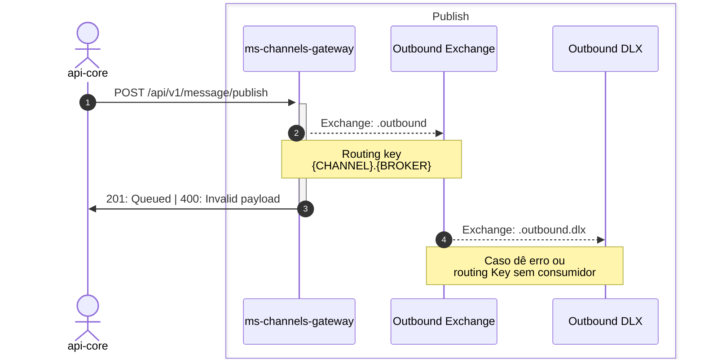
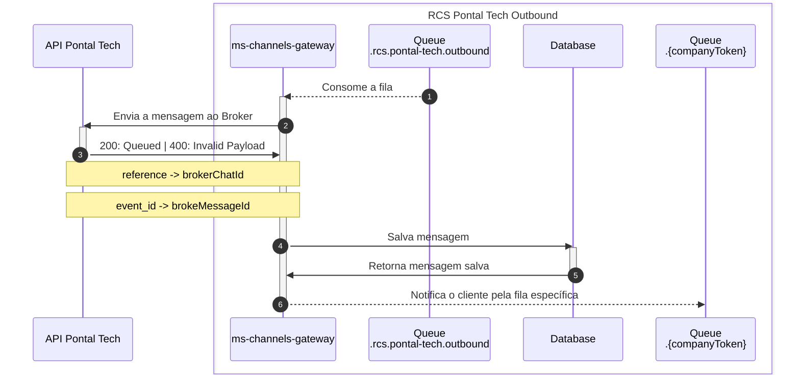
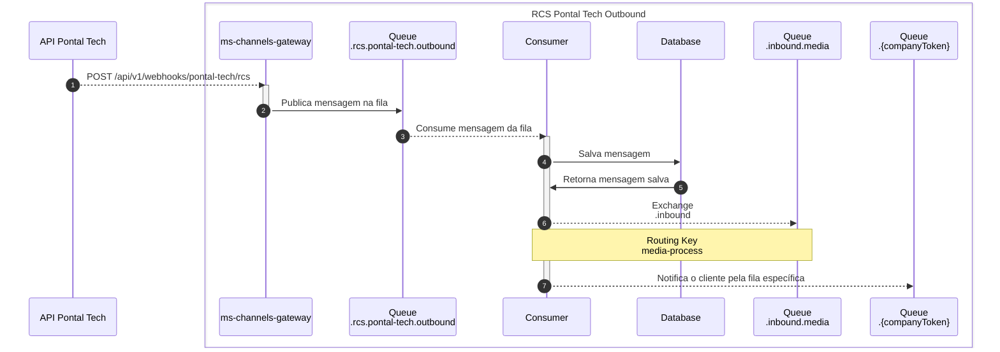
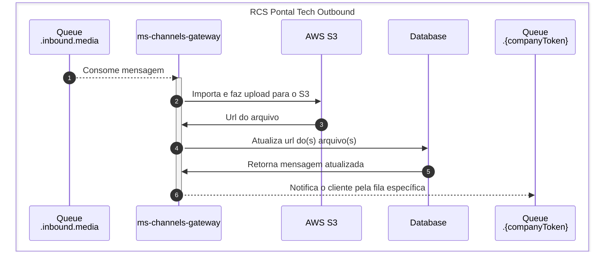

# Channels gateway

Projeto que será responsável por rotear as mensagens ao seus respectivos pares de Channel -> Broker

## Casos de uso

> Todas as exchanges e filas tem o prefixo ms-channels-gateway, suprimido dos diagramas que começam apenas com . (ponto), ex: .outbound se refere a exchange ms-channels-gateway.outbound

### Outbound
> **Ativo** ::  _plataforma -> cliente_

### Publish
> _POST_ /api/v1/message/publish

Fluxo responsável por receber uma mensagem, validar o payload e enfileirar para processamento de acordo com as configurações do channelConfigId

- Validação de payload de acordo com o type + messageType
- Valida se o channelConfigId é válido, ou seja, existe e o status é ATIVO

#### Estrutura base
```json
{
    "channelConfigId": "",
    "referenceChatId": "",
    "recipients": [
        "11988881234"
    ],
    "payload": {
        "type": "rcs",
        "content": {/* text, image, document, carousel, rich card */}
    }
}
```

### Tipos possíveis para o _content_

#### text
```json
{            
  "messageType": "text",
  "text": "Olá, somos da Digitalk! Vamos testar?"
}
```
> text deve ter no máximo 2000 caracteres

#### image

```json
{
    "messageType": "image",
    "url": "https://example.com/image.png"          
}
```

#### document
> IMPORTANTE!:  Atualmente a Pontal Tech só envia documentos do tipo PDF. Qualquer outro tipo é retornado erro 400

```json
{
    "messageType": "document",
    "url": "https://example.com/document.pdf"          
}
```

#### carousel
```json
{
  "messageType": "carousel",
  "items": [
      {
          "title": "Item 1",
          "description": "Já chegam sabendo onde fazer as necessidades <3",
          "fileUrl": "https://example.com/image.png"
      },
  ]  
}
```
> item.tile deve ter no máximo 160 caracteres<br>
> item.description deve ter no máximo 2000 caracteres

#### rich-card
```json
{
  "messageType": "rich-card",
  "title": "Que tal um rich card com gatinhos?",
  "description": "E uma descrição massa?!",
  "fileUrl": "https://example.com/image.png" 
}
```
> tile deve ter no máximo 160 caracteres<br>
> description deve ter no máximo 2000 caracteres

### Diagrama de fluxo da publicação de mensagem



### Diagrama de fluxo de envio de mensagem via RCS -> Pontal Tech




### Sincronização de status da mensagem

> **Status** :: _outbound status -> plataforma_

#### Mensagem enfileirada
_Mensagem enviada ao Broker_
```json
{
  "eventType": "message",
  "direction": "outbound",
  "status": "queued",
  "referenceChatId": "0f27a7e4-0e8a-43c0-b6b4-8805e39825ae",
  "messageId": "cfdd0783-327f-412f-ace0-ffda57cb8c7e",
  "date": "2024-10-23T16:02:46.506Z",
  "message": {
    "type": "rcs",
    "messageType": "text",
    "text": "Olá, somos da Digitalk! Vamos testar?"
  }
}
```

#### Mensagem enviada
```json
{
  "eventType": "status",
  "direction": "outbound",
  "status": "sent",
  "referenceChatId": "0f27a7e4-0e8a-43c0-b6b4-8805e39825ae",
  "messageId": "cfdd0783-327f-412f-ace0-ffda57cb8c7e",
  "date": "2024-10-23T13:02:46.771Z",
  "message": null,
  "errorMessage": null
}
```

#### Mensagem recebida
```json
{
  "eventType": "status",
  "direction": "outbound",
  "status": "delivered",
  "referenceChatId": "0f27a7e4-0e8a-43c0-b6b4-8805e39825ae",
  "messageId": "cfdd0783-327f-412f-ace0-ffda57cb8c7e",
  "date": "2024-10-23T13:02:55.907Z",
  "message": null,
  "errorMessage": null
}
```

#### Mensagem lida
```json
{
  "eventType": "status",
  "direction": "outbound",
  "status": "read",
  "referenceChatId": "0f27a7e4-0e8a-43c0-b6b4-8805e39825ae",
  "messageId": "cfdd0783-327f-412f-ace0-ffda57cb8c7e",
  "date": "2024-10-23T13:06:04.432Z",
  "message": null,
  "errorMessage": null
}
```

#### Resposta de texto recebida
```json
{
  "eventType": "message",
  "direction": "inbound",
  "status": "delivered",
  "referenceChatId": "0f27a7e4-0e8a-43c0-b6b4-8805e39825ae",
  "messageId": "5490baa5-3c9e-4cc4-939f-60db0f3a3e76",
  "date": "2024-10-23T16:30:23.457Z",
  "message": {
    "type": "rcs",
    "messageType": "text",
    "text": "Claro que sim 😌"
  }
}
```

#### Resposta de arquivo recebida
> Aqui temos 2 status: QUEUED e DELIVERED
> 
> QUEUED: Recebemos a mensagem com a URL original, e a enviamos para processamento em outra fila
>
> Aqui um exemplo de recebimento de arquivo do tipo pem
```json
{
  "eventType": "message",
  "direction": "inbound",
  "status": "queued",
  "referenceChatId": "0f27a7e4-0e8a-43c0-b6b4-8805e39825ae",
  "messageId": "f31d4449-c85c-4394-8229-8ca2ed5fe5f1",
  "date": "2024-10-23T17:09:20.594Z",
  "message": {
    "type": "rcs",
    "messageType": "document",
    "url": "https://rcs-copper-us.googleapis.com/4227caba-a692-49ce-920b-45eedb973eb8/255a503e501daccf66f1cb2b9eb060b15cf023b2e27a4ec034f6a2ce48e2",
    "mimeType": "application/x-pem-file",
    "fileName": "ca.pem"
  }
}
```

> DELIVERED: Importamos com sucesso o arquivo para nosso storage, atualmente no S3, e informa a nova url
```json
{
  "eventType": "status",
  "direction": "inbound",
  "status": "delivered",
  "referenceChatId": "0f27a7e4-0e8a-43c0-b6b4-8805e39825ae",
  "messageId": "f31d4449-c85c-4394-8229-8ca2ed5fe5f1",
  "date": "2024-10-23T17:09:20.594Z",
  "message": {
    "type": "rcs",
    "messageType": "document",
    "url": "https://apis-storage-homol.s3.sa-east-1.amazonaws.com/ms-channels-gateway/f09fcbc6edb265426f216e49854cab5ed3d281c6/ca.pem",
    "mimeType": "application/x-pem-file",
    "fileName": "ca.pem"
  }
}
```

> Temos também outros recebimentos específicos, e o processo de QUEUED ->  DELIVERED se mantém

#### Image
```json
{
  "eventType": "message",
  "direction": "outbound",
  "status": "queued",
  "referenceChatId": "0f27a7e4-0e8a-43c0-b6b4-8805e39825ae",
  "messageId": "6b4f0daa-ffa2-479e-983e-fdfa26d65024",
  "date": "2024-10-23T17:52:34.014Z",
  "message": {
    "type": "rcs",
    "messageType": "image",
    "url": "https://cdn.britannica.com/34/235834-050-C5843610/two-different-breeds-of-cats-side-by-side-outdoors-in-the-garden.jpg?source=4"
  }
}
```

#### Coordenadas
```json
{
  "eventType": "message",
  "direction": "inbound",
  "status": "delivered",
  "referenceChatId": "0f27a7e4-0e8a-43c0-b6b4-8805e39825ae",
  "messageId": "22fbca1c-d73b-472d-8284-4c034c60cddc",
  "date": "2024-10-23T19:57:21.019Z",
  "message": {
    "type": "rcs",
    "messageType": "location",
    "latitude": -27.6068941,
    "longitude": -48.4835356
  }
}
```

#### Webhooks

RCS - Pontal Tech

> _POST_ /api/v1/webhooks/pontal-tech/rcs

Fluxo responsável por receber as mensagens e status de mensagens enviadas

#### Estrutura base

```json
{
    "status": "", // Vem somente em casos de erro
    "reference": "",
    "event_id": "",
    "direction": "", // inbound | outbound
    "user_id": "", // Telefone do cliente que enviou a mensagem, pode vir com ou sem DDI
    "timestamp": "", // ISO
    "channel": "rcs",
    "type": "", // basic | single
    "message": { /* text, image, video, document */ },
    "vars": {} // Caso envie variáveis no ativo, ele retorna aqui
}
```

### Diagrama de fluxo para recebimento de mensagem via RCS -> Pontal Tech



### Diagrama de fluxo para processamento de media




<hr />

# Development

## Project setup

```bash
$ npm install
```

## Compile and run the project

```bash
# development
$ npm run start

# watch mode
$ npm run start:dev

# production mode
$ npm run start:prod
```

## Run tests

```bash
# unit tests
$ npm run test

# e2e tests
$ npm run test:e2e

# test coverage
$ npm run test:cov
```

## Resources

- RabbitMQ para enfileiramento de mensagens enviadas/recebidas
- Redis para cache de configurações, listagens, etc
- class validator para validação de DTOs