# Channels gateway

Projeto que será responsável por rotear as mensagens ao seus respectivos pares de Channel -> Broker

## Casos de uso

> Todas as exchanges e filas tem o prefixo ms-channels-gateway, suprimido dos diagramas que começam apenas com . (ponto), ex: .outbound se refere a exchange ms-channels-gateway.outbound

### Outbound
> **Ativo** ::  _plataforma -> cliente_

### Publish
> _POST_ /api/v1/**messages**/publish

Fluxo responsável por receber uma mensagem, validar o payload e enfileirar para processamento de acordo com as configurações do channelConfigId

- Validação de payload de acordo com o type + messageType
- Valida se o channelConfigId é válido, ou seja, existe e o status é ATIVO

#### Estrutura base
```json
{
    "channelConfigId": "",
    "referenceChatId": "",
    "recipients": [
        "11988881234"
    ],
    "payload": {
        "type": "rcs",
        "content": {/* text, image, document, video, carousel, rich-card, actions */}
    }
}
```

### Tipos possíveis para o _content_

#### text
```json
{            
  "messageType": "text",
  "text": "Olá, somos da Digitalk! Vamos testar?"
}
```
> text deve ter no máximo 2000 caracteres

#### image

```json
{
    "messageType": "image",
    "url": "https://example.com/image.png"          
}
```

#### document
> IMPORTANTE!:  Atualmente a Pontal Tech só envia documentos do tipo PDF. Qualquer outro tipo é retornado erro 400

```json
{
    "messageType": "document",
    "url": "https://example.com/document.pdf"          
}
```

#### carousel
```json
{
  "messageType": "carousel",
  "items": [
    {
      "title": "Item 1",
      "description": "Já chegam sabendo onde fazer as necessidades <3",
      "fileUrl": "https://example.com/image.png",
      "suggestions": [ 
        {
          "type": "openUrl",
          "title": "Link?",
          "value": "https://digitalk.com.br/?query="
        },
        {
          "type": "call",
          "title": "Call?",
          "value": 48991900104
        },
        {
        "type": "reply",
        "title": "Reply #1",
        "value": "VALOR DO REPLY #1"
        }
      ]
    },
  ]  
}
```
> item.tile deve ter no máximo 160 caracteres<br>
> item.description deve ter no máximo 2000 caracteres

#### rich-card
```json
{
  "messageType": "rich-card",
  "title": "Que tal um rich card com gatinhos?",
  "description": "E uma descrição massa?!",
  "fileUrl": "https://example.com/image.png",
  "suggestions": [ 
    {
      "type": "openUrl",
      "title": "Link?",
      "value": "https://digitalk.com.br/?query="
    },
    {
      "type": "call",
      "title": "Call?",
      "value": 48991900104
    },
    {
    "type": "reply",
    "title": "Reply #1",
    "value": "VALOR DO REPLY #1"
    }
  ]
}
```
> tile deve ter no máximo 160 caracteres<br>
> description deve ter no máximo 2000 caracteres

#### actions
```json
{
  "messageType": "actions",
  "title": "Escolha uma das opções:",
  "actions": [ 
    {
      "type": "openUrl",
      "title": "Link?",
      "value": "https://digitalk.com.br/?query="
    },
    {
      "type": "call",
      "title": "Call?",
      "value": 48991900104
    },
    {
    "type": "reply",
    "title": "Reply #1",
    "value": "VALOR DO REPLY #1"
    }
  ]
}
```

### Diagrama de fluxo da publicação de mensagem

```mermaid
sequenceDiagram
  autonumber
  actor core as api-core
  box Publish
  participant mcg as ms-channels-gateway
  participant ex-out as Outbound Exchange
  participant mcg
  participant ex-out-dead as Outbound DLX
  end
  activate mcg
  core->>+mcg: POST /api/v1/message/publish
  mcg-->>ex-out: Exchange: .outbound
  note over mcg,ex-out: Routing key<br>{CHANNEL}.{BROKER}
  mcg->>core: 201: Queued | 400: Invalid payload
  deactivate mcg
  ex-out-->>ex-out-dead: Exchange: .outbound.dlx
  note over ex-out,ex-out-dead: Caso dê erro ou<br>routing Key sem consumidor
```



### Diagrama de fluxo de envio de mensagem via RCS -> Pontal Tech


### Sincronização de status da mensagem

> **Status** :: _outbound status -> plataforma_

  Status possíveis:
- queued
- sent
- delivered
- read
- error

#### Mensagem enfileirada
_Mensagem enviada ao Broker_
```json
{
  "eventType": "message",
  "direction": "outbound",
  "status": "queued",
  "referenceChatId": "0f27a7e4-0e8a-43c0-b6b4-8805e39825ae",
  "messageId": "cfdd0783-327f-412f-ace0-ffda57cb8c7e",
  "date": "2024-10-23T16:02:46.506Z",
  "message": {
    "type": "rcs",
    "messageType": "text",
    "text": "Olá, somos da Digitalk! Vamos testar?"
  },
  "channelConfigId":"b838e316-8289-4146-bc8f-91ca3c65c565",
  "channel":"rcs",
  "broker":"pontal-tech",
  "contact": "48991900104",
  "channelConfigId": "b838e316-8289-4146-bc8f-91ca3c65c565"
}
```

#### Mensagem enviada ao destinatário
```json
{
  "eventType": "status",
  "direction": "outbound",
  "status": "sent",
  "referenceChatId": "0f27a7e4-0e8a-43c0-b6b4-8805e39825ae",
  "messageId": "cfdd0783-327f-412f-ace0-ffda57cb8c7e",
  "date": "2024-10-23T13:02:46.771Z",
  "message": null,
  "errorMessage": null,
  "channelConfigId":"b838e316-8289-4146-bc8f-91ca3c65c565",
  "channel":"rcs",
  "broker":"pontal-tech",
  "contact": "48991900104",
  "channelConfigId": "b838e316-8289-4146-bc8f-91ca3c65c565"
}
```

#### Mensagem recebida pelo destinatário
```json
{
  "eventType": "status",
  "direction": "outbound",
  "status": "delivered",
  "referenceChatId": "0f27a7e4-0e8a-43c0-b6b4-8805e39825ae",
  "messageId": "cfdd0783-327f-412f-ace0-ffda57cb8c7e",
  "date": "2024-10-23T13:02:55.907Z",
  "message": null,
  "errorMessage": null,
  "channelConfigId":"b838e316-8289-4146-bc8f-91ca3c65c565",
  "channel":"rcs",
  "broker":"pontal-tech",
  "contact": "48991900104",
  "channelConfigId": "b838e316-8289-4146-bc8f-91ca3c65c565"
}
```

#### Mensagem lida pelo destinatário
```json
{
  "eventType": "status",
  "direction": "outbound",
  "status": "read",
  "referenceChatId": "0f27a7e4-0e8a-43c0-b6b4-8805e39825ae",
  "messageId": "cfdd0783-327f-412f-ace0-ffda57cb8c7e",
  "date": "2024-10-23T13:06:04.432Z",
  "message": null,
  "errorMessage": null,
  "channelConfigId":"b838e316-8289-4146-bc8f-91ca3c65c565",
  "channel":"rcs",
  "broker":"pontal-tech",
  "contact": "48991900104",
  "channelConfigId": "b838e316-8289-4146-bc8f-91ca3c65c565"
}
```

### Respostas recebidas
Tipos possíveis:
- text
- document
- image
- audio
- video

#### Resposta de texto recebida
```json
{
  "eventType": "message",
  "direction": "inbound",
  "status": "delivered",
  "referenceChatId": "0f27a7e4-0e8a-43c0-b6b4-8805e39825ae",
  "messageId": "5490baa5-3c9e-4cc4-939f-60db0f3a3e76",
  "date": "2024-10-23T16:30:23.457Z",
  "message": {
    "type": "rcs",
    "messageType": "text",
    "text": "Claro que sim 😌"
  },
  "channelConfigId":"b838e316-8289-4146-bc8f-91ca3c65c565",
  "channel":"rcs",
  "broker":"pontal-tech",
  "contact": "48991900104",
  "channelConfigId": "b838e316-8289-4146-bc8f-91ca3c65c565"
}
```

#### Resposta de arquivo recebida
> Aqui temos 2 status: QUEUED e DELIVERED
> 
> QUEUED: Recebemos a mensagem com a URL original, e a enviamos para processamento em outra fila
>
> Aqui um exemplo de recebimento de arquivo do tipo pem
```json
{
  "eventType": "message",
  "direction": "inbound",
  "status": "queued",
  "referenceChatId": "0f27a7e4-0e8a-43c0-b6b4-8805e39825ae",
  "messageId": "f31d4449-c85c-4394-8229-8ca2ed5fe5f1",
  "date": "2024-10-23T17:09:20.594Z",
  "message": {
    "type": "rcs",
    "messageType": "document",
    "url": "https://rcs-copper-us.googleapis.com/4227caba-a692-49ce-920b-45eedb973eb8/255a503e501daccf66f1cb2b9eb060b15cf023b2e27a4ec034f6a2ce48e2",
    "mimeType": "application/x-pem-file",
    "fileName": "ca.pem"
  },
  "channelConfigId":"b838e316-8289-4146-bc8f-91ca3c65c565",
  "channel":"rcs",
  "broker":"pontal-tech",
  "contact": "48991900104",
  "channelConfigId": "b838e316-8289-4146-bc8f-91ca3c65c565"
}
```

> DELIVERED: Importamos com sucesso o arquivo para nosso storage, atualmente no S3, e informa a nova url
```json
{
  "eventType": "status",
  "direction": "inbound",
  "status": "delivered",****
  "referenceChatId": "0f27a7e4-0e8a-43c0-b6b4-8805e39825ae",
  "messageId": "f31d4449-c85c-4394-8229-8ca2ed5fe5f1",
  "date": "2024-10-23T17:09:20.594Z",
  "message": {
    "type": "rcs",
    "messageType": "document",
    "url": "https://apis-storage-homol.s3.sa-east-1.amazonaws.com/ms-channels-gateway/f09fcbc6edb265426f216e49854cab5ed3d281c6/ca.pem",
    "mimeType": "application/x-pem-file",
    "fileName": "ca.pem"
  },
  "channelConfigId":"b838e316-8289-4146-bc8f-91ca3c65c565",
  "channel":"rcs",
  "broker":"pontal-tech",
  "contact": "48991900104",
  "channelConfigId": "b838e316-8289-4146-bc8f-91ca3c65c565"
}
```

> Temos também outros recebimentos específicos, e o processo de QUEUED ->  DELIVERED se mantém

#### Resposta com imagem recebida
```json
{
  "eventType": "status",
  "direction": "inbound",
  "status": "delivered",
  "referenceChatId": "e2e37727-7e52-4edc-8151-b8ee7b681675",
  "messageId": "dc9ad1a0-cc5e-4c55-b7e5-bf39f3d95014",
  "date": "2024-11-06T16:50:13.754Z",
  "message": {
    "type": "rcs",
    "messageType": "image",
    "url": "https://apis-storage-homol.s3.sa-east-1.amazonaws.com/ms-channels-gateway/3f20be52c4894c552c369a58e199288320a3b4c3/1000018709.jpg",
    "mimeType": "image/jpeg",
    "fileName": "1000018709.jpg"
  },
  "channelConfigId":"b838e316-8289-4146-bc8f-91ca3c65c565",
  "channel":"rcs",
  "broker":"pontal-tech",
  "contact": "48991900104",
  "channelConfigId": "b838e316-8289-4146-bc8f-91ca3c65c565"
}
```

#### Resposta de audio recebida
```json
{
  "eventType": "status",
  "direction": "inbound",
  "status": "delivered",
  "referenceChatId": "e2e37727-7e52-4edc-8151-b8ee7b681675",
  "messageId": "c91cdd9a-dc67-4600-a77b-47cf2c38a48a",
  "date": "2024-11-06T16:40:37.501Z",
  "message": {
    "type": "rcs",
    "messageType": "audio",
    "url": "https://apis-storage-homol.s3.sa-east-1.amazonaws.com/ms-channels-gateway/eada746fad1716825ac4b82d8ccc263de7d92746/2169369951126844617.m4a",
    "mimeType": "audio/mp4",
    "fileName": "2169369951126844617.m4a"
  },
  "channelConfigId":"b838e316-8289-4146-bc8f-91ca3c65c565",
  "channel":"rcs",
  "broker":"pontal-tech",
  "contact": "48991900104",
  "channelConfigId": "b838e316-8289-4146-bc8f-91ca3c65c565"
}
```

#### Resposta de vídeo recebida
```json
{
  "eventType": "status",
  "direction": "inbound",
  "status": "delivered",
  "referenceChatId": "e2e37727-7e52-4edc-8151-b8ee7b681675",
  "messageId": "c82c91cc-a609-4d33-be73-ec2aab419f41",
  "date": "2024-11-06T16:51:49.666Z",
  "message": {
    "type": "rcs",
    "messageType": "video",
    "url": "https://apis-storage-homol.s3.sa-east-1.amazonaws.com/ms-channels-gateway/478b3161beaf0dde5a2fe7b5f7578f18ef750131/1000018377.mp4",
    "mimeType": "video/mp4",
    "fileName": "1000018377.mp4"
  },
  "channelConfigId":"b838e316-8289-4146-bc8f-91ca3c65c565",
  "channel":"rcs",
  "broker":"pontal-tech",
  "contact": "48991900104",
  "channelConfigId": "b838e316-8289-4146-bc8f-91ca3c65c565"
}
```

#### Resposta com coordenadas recebida
```json
{
  "eventType": "message",
  "direction": "inbound",
  "status": "delivered",
  "referenceChatId": "0f27a7e4-0e8a-43c0-b6b4-8805e39825ae",
  "messageId": "22fbca1c-d73b-472d-8284-4c034c60cddc",
  "date": "2024-10-23T19:57:21.019Z",
  "message": {
    "type": "rcs",
    "messageType": "location",
    "latitude": -27.6068941,
    "longitude": -48.4835356
  },
  "channelConfigId":"b838e316-8289-4146-bc8f-91ca3c65c565",
  "channel":"rcs",
  "broker":"pontal-tech",
  "contact": "48991900104",
  "channelConfigId": "b838e316-8289-4146-bc8f-91ca3c65c565"
}
```

#### Resposta de callback de action
```json
{
  "channel": "rcs",
  "broker": "pontal-tech",
  "eventType": "message",
  "direction": "inbound",
  "status": "read",
  "referenceChatId": "55b917c5-0e5a-40cc-958e-9a308dc50c75",
  "referenceMessageId": "68412613-a50a-4fcd-8a56-51b2a889ed32",
  "messageId": "5c03d742-aff5-4074-9d8a-0bcd173191fd",
  "date": "2024-12-04T20:04:24.661Z",
  "message": {
    "type": "rcs",
    "messageType": "action-callback",
    "callback": {
      "type": "reply",
      "title": "Reply #2 c/ 25 caracteres",
      "value": "VALOR DO REPLY #2"
    }
  },
  "contact": "48991900104",
  "channelConfigId": "b838e316-8289-4146-bc8f-91ca3c65c565"
}
```

### Erros
> Direto ao ponto: Ainda não é feito nenhum mapeamento dos erros retornados pelos brokers, o serviço apenas repassa a mensagem de erro recebida

#### Erro ao enviar RCS para número que não possui o recurso habilitado

```json
{
  "eventType": "status",
  "direction": "outbound",
  "status": "error",
  "referenceChatId": "461f0480-2439-4da3-91f8-c5fed037fb3e",
  "messageId": "614fc723-98ff-4c0e-ac4c-15238d69d11e",
  "date": "2024-11-05T18:12:18.136Z",
  "message": null,
  "errorMessage": "Request failed with status code 404",
  "channelConfigId":"b838e316-8289-4146-bc8f-91ca3c65c565",
  "channel":"rcs",
  "broker":"pontal-tech",
  "contact": "48991900104",
  "channelConfigId": "b838e316-8289-4146-bc8f-91ca3c65c565"
}
```

#### Erro ao enviar o mesmo RCS em uma janela de 1h 

```json 
{
  "eventType": "status",
  "direction": "outbound",
  "status": "error",
  "referenceChatId": "d8c790f5-87bc-40ee-a385-9977e8fc6559",
  "messageId": "968bee3c-9fe7-42db-a0a2-b48b9f4fe83c",
  "date": "2024-11-05T18:16:46.209Z",
  "message": null,
  "errorMessage": "bloqueado por duplicidade",
  "channelConfigId":"b838e316-8289-4146-bc8f-91ca3c65c565",
  "channel":"rcs",
  "broker":"pontal-tech",
  "contact": "48991900104",
  "channelConfigId": "b838e316-8289-4146-bc8f-91ca3c65c565"
}
```

#### Webhooks

RCS - Pontal Tech

> _POST_ /api/v1/webhooks/pontal-tech/rcs

Fluxo responsável por receber as mensagens e status de mensagens enviadas

#### Estrutura base

```json
{
    "status": "", // Vem somente em casos de erro
    "reference": "",
    "event_id": "",
    "direction": "", // inbound | outbound
    "user_id": "", // Telefone do cliente que enviou a mensagem, pode vir com ou sem DDI
    "timestamp": "", // ISO
    "channel": "rcs",
    "type": "", // basic | single
    "message": { /* text, image, video, document */ },
    "vars": {} // Caso envie variáveis no ativo, ele retorna aqui
}
```

### Diagrama de fluxo para recebimento de mensagem via RCS -> Pontal Tech


### Diagrama de fluxo para processamento de mídia


## Endpoints para gerenciamento de configurações e contas


<hr />

# Development

## Project setup

```bash
$ npm install
```

## Compile and run the project

```bash
# development
$ npm run start

# watch mode
$ npm run start:dev

# production mode
$ npm run start:prod
```

## Run tests

```bash
# unit tests
$ npm run test

# e2e tests
$ npm run test:e2e

# test coverage
$ npm run test:cov
```

## Resources

- RabbitMQ para enfileiramento de mensagens enviadas/recebidas
- Redis para cache de configurações, listagens, etc
- class validator para validação de DTOs